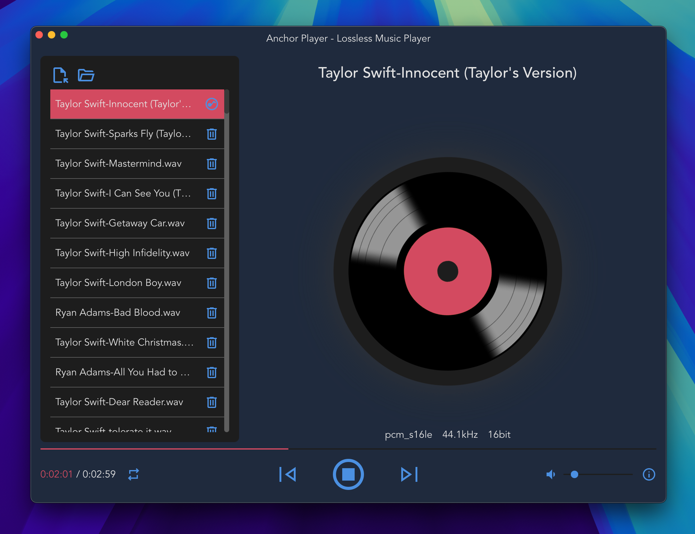
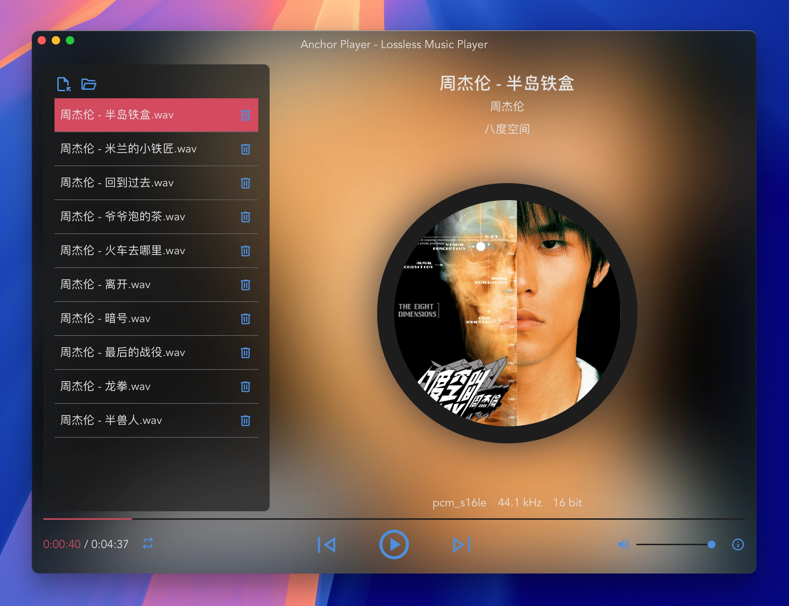

# AnchorPlayer

Enjoy high-fidelity audio with this Rust-based player, which uses [Tauri](https://github.com/tauri-apps/tauri) for a smooth user experience and [Symphonia](https://github.com/pdeljanov/Symphonia) for robust audio processing, supporting formats like FLAC, WAV, OGG (lossless), and MP3, AAC, and MKV (audio) for versatile playback.

## screenshot

## Release
- [macOS](https://github.com/crazytravel/anchor-player/releases/download/v0.1.0/Anchor.Player_0.1.0_aarch64.dmg)
- [Windows(TODO)]()
- [Linux(TODO)]()
